# 🔍 Frontend Connection Issue - Complete Diagnosis & Fix

## ❌ **Root Cause Identified**

The CI/CD pipeline is completing successfully, but the frontend remains "Disconnected" due to **two critical issues**:

### **Issue 1: Missing Job Outputs in CI/CD**
```yaml
# ❌ BEFORE (Missing outputs)
build-and-deploy-backend:
  name: Build and Deploy Backend
  # Missing: outputs section
```

```yaml
# ✅ AFTER (Fixed)
build-and-deploy-backend:
  name: Build and Deploy Backend
  outputs:
    backend-url: ${{ steps.deploy-backend.outputs.backend-url }}
```

### **Issue 2: Frontend Built Without Backend URL**

**The Problem**: Next.js builds environment variables starting with `NEXT_PUBLIC_` into the bundle at **build time**, not runtime.

1. **CI/CD Build Phase**: Frontend built without backend URL (because backend wasn't deployed yet)
2. **Runtime Phase**: Environment variable set on Cloud Run service
3. **Result**: Frontend code still has `undefined` or fallback URL baked into the build

## 🧪 **Diagnosis Confirmation**

### **✅ Backend Service Working**
```bash
curl https://storygen-backend-ws-service-7qwcxs6azq-uc.a.run.app/health
# ✅ Response: {"status":"healthy","service":"storygen-backend"}
```

### **✅ Frontend Environment Variable Set**
```bash
gcloud run services describe storygen-frontend --format="value(spec.template.spec.containers[0].env[0].value)"
# ✅ Response: https://storygen-backend-ws-service-7qwcxs6azq-uc.a.run.app
```

### **❌ Frontend Code Still Disconnected**
The frontend shows "Disconnected" because it was built with a fallback URL, and the runtime environment variable doesn't override the build-time value.

## 🔧 **Complete Fix Applied**

### **1. Fixed CI/CD Job Outputs** ✅

Added proper job outputs to pass backend URL between jobs:

```yaml
# Backend job now exports URL
build-and-deploy-backend:
  outputs:
    backend-url: ${{ steps.deploy-backend.outputs.backend-url }}

# Frontend job now exports URL  
build-and-deploy-frontend:
  outputs:
    frontend-url: ${{ steps.deploy-frontend.outputs.frontend-url }}
```

### **2. Fixed Job Dependencies** ✅

Frontend now waits for backend and uses its URL:

```yaml
build-and-deploy-frontend:
  needs: [setup-infrastructure, build-and-deploy-backend]
  
  steps:
    - name: Build and push frontend Docker image
      run: |
        # Get backend URL from previous job
        BACKEND_URL="${{ needs.build-and-deploy-backend.outputs.backend-url }}"
        
        # Build with backend URL
        docker build \
          --build-arg NEXT_PUBLIC_BACKEND_URL="$BACKEND_URL" \
          -t IMAGE_NAME .
```

### **3. Fixed Health Check Job** ✅

Health check now gets URLs from previous jobs:

```yaml
health-check:
  needs: [build-and-deploy-backend, build-and-deploy-frontend]
  steps:
    - name: Test Backend Health
      run: |
        BACKEND_URL="${{ needs.build-and-deploy-backend.outputs.backend-url }}"
        # Now has access to the actual backend URL
```

## 🎯 **Expected Results After Next CI/CD Run**

### **✅ What Will Work**
1. **Backend URL Capture**: `deploy-backend` step will output the actual backend URL
2. **Frontend Build**: Frontend will be built with the correct `NEXT_PUBLIC_BACKEND_URL`
3. **Health Validation**: Health check will test the actual deployed URLs
4. **Connected Frontend**: Frontend will show "Connected" instead of "Disconnected"

### **📋 Deployment Flow**

```mermaid
graph TD
    A[Setup Infrastructure] --> B[Deploy Backend]
    B --> C[Capture Backend URL]
    C --> D[Build Frontend with Backend URL]
    D --> E[Deploy Frontend] 
    E --> F[Health Check Both Services]
    F --> G[✅ Connected Frontend]
```


## 🚀 **Next Steps**

### **Immediate Action**
1. **Push the updated CI/CD workflow** (already fixed in `.github/workflows/ci-cd.yml`)
2. **Monitor the pipeline** - all jobs should pass AND produce a working frontend
3. **Verify connection** at both URLs:
   - [https://storygen-frontend-453527276826.us-central1.run.app/](https://storygen-frontend-453527276826.us-central1.run.app/)
   - [https://storygen-frontend-7qwcxs6azq-uc.a.run.app/](https://storygen-frontend-7qwcxs6azq-uc.a.run.app/)

### **Expected Results**
- ✅ **Backend Health**: `{"status":"healthy","service":"storygen-backend"}`
- ✅ **Frontend Status**: "Connected" with green indicator
- ✅ **Health Check Job**: Passes with actual service URLs
- ✅ **Story Generation**: Fully functional end-to-end

## 🔍 **Verification Commands**

After the next successful CI/CD run:

```bash
# 1. Test backend health
curl https://storygen-backend-ws-service-7qwcxs6azq-uc.a.run.app/health

# 2. Check frontend environment variable
gcloud run services describe storygen-frontend \
  --region=us-central1 --project=sdlc-468305 \
  --format="value(spec.template.spec.containers[0].env[0].value)"

# 3. Check if frontend shows connected
# Visit: https://storygen-frontend-453527276826.us-central1.run.app/
```

## 📊 **Summary**

| Issue | Status | Fix Applied |
|-------|--------|-------------|
| ❌ Job outputs missing | ✅ Fixed | Added `outputs` to both jobs |
| ❌ Frontend built without backend URL | ✅ Fixed | Build with `--build-arg NEXT_PUBLIC_BACKEND_URL` |
| ❌ Health check failing | ✅ Fixed | Uses job outputs for URLs |
| ❌ Frontend shows "Disconnected" | 🔄 Will fix | Next CI/CD run will rebuild correctly |

## 🎉 **Confidence Level: HIGH**

The root cause is definitively identified and the comprehensive fix addresses all issues. The next CI/CD run should produce a fully functional, connected deployment.

**Push to main and the deployment should work perfectly!** 🚀
